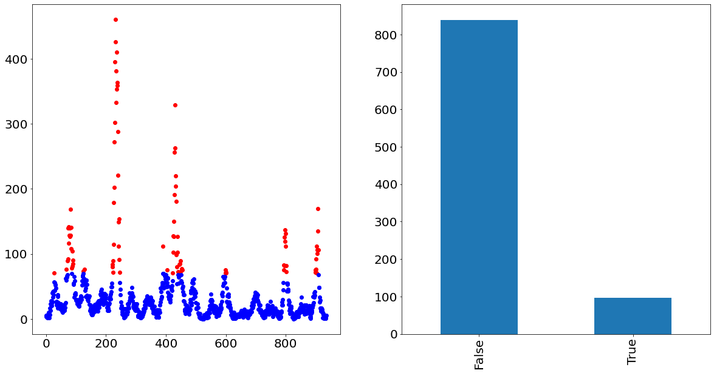
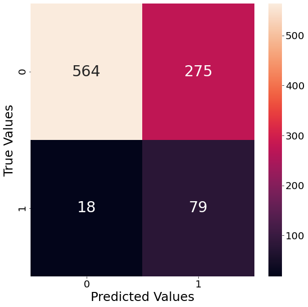

*The workings of the underlying prediction pipeline*

## Background on the DengAI Challenge

This post represents the second part out of a series of two blogpost discussing our second attempt of the DengAI forecasting challenge hosted by DrivenData.org. Within this challenge we are tasked to predict the number of dengue fever cases in two different cities, San Juan as well as Iquitos. What makes this challenge so difficult is that we are asked to forecast multiple years into the feature, even though we do not have very many observations for each city to begin with.

Whenever facing a data science challenge, we often run into the issue of **data leakage**. Data leakage describes the problem of having information which belongs to the trainings set within the test data. For example, when fitting a scaler (e.g. a MinMaxScaler from scikit-learn) and we apply this scaler before train-test-splitting our data, we accidentally scaled the trainings data using information from the test data. Examples like this usually result in a superior prediction performance than would have been the case if we would have separated train and test data properly.

Even when properly splitting train and test data in the beginning of our code, applying every single step we used for the trainings data and apply it on the test data is cumbersome and prone to errors. What we would rather like to do is to combine all feature engineering steps we apply to the trainings data and fit this combinations of steps on the trainings data, before applying all steps on the test data. The solution to this problem is called a **pipeline**.

## Benefits of using a pipeline

In order to make the benefits of using a pipeline even clearer, let us consider the following simple example, in which we would like to scale the data, impute it and afterwards fit a LinearRegression.


```python
import numpy as np

X_train = [[1, 2, 3], [2, np.nan, 3], [5, 6, 7]]
X_test = [[2, 5, np.nan]]
y_train = [2, 5, 4]
```

In the case without using a pipeline we have to apply the scaler and imputation method first on the trainings data, save the instance and afterwards apply to the test data in order to get a prediction:


```python
from sklearn.preprocessing import MinMaxScaler
from sklearn.impute import KNNImputer
from sklearn.linear_model import LinearRegression

# Fitting everything on the trainings data
scaler = MinMaxScaler().fit(X_train)
scaled_data = scaler.transform(X_train)

imputer = KNNImputer().fit(scaled_data)
imputed_data = imputer.transform(scaled_data)

model = LinearRegression().fit(imputed_data, y_train)

# Applying all steps on the test data
scaled_data_test = scaler.transform(X_test)
imputed_data_test = imputer.transform(scaled_data_test)
y_pred_test = model.predict(imputed_data_test)
print(y_pred_test)
```

    [4.97222222]


As we can see from the example above that even a simple prediction method becomes quite complex when not using pipelines. Not only do we always have to remember what the output from the prior step was saved as in order to input it into the next step, but also we have to remember what all the instances from our preprocessing steps are called. When doing exactly the same but with using pipelines, the benefits become clear immediately.


```python
from sklearn.pipeline import make_pipeline

pipeline = make_pipeline(
    MinMaxScaler(),
    KNNImputer(),
    LinearRegression()
)

pipeline.fit(X_train, y_train)
y_pred = pipeline.predict(X_test)
print(y_pred)
```

    [4.97222222]


Not only did we need significantly less code, there is no unnecessary data assigning and constant fitting and transforming of instances. Furthermore, the defined pipeline is easy to apply to other data. One other benefit is that it is possible to write custom classes which are then possible to be inserted into the pipeline.

Because of all of these benefits we decided to go with this technique for our challenge. The purpose of this post is to outline how our pipeline we used for this data challenge works under the hood.

## Structure of this post

In order to give the reader a solid understanding how our prediction pipeline-powered prediction model works, we show all classes within the pipeline and explain our steps. On a high-level the pipeline has nine different steps.

The pipeline starts with the **Encoding** of all variables which are not in a numeric format. That applies especially to date variables, as well as variables which are in an ordinal form (date of the month).

Since dummy variables are created, we have to make sure that we do not accidentally end up with having categories within the test data, which do not show up in the trainings data. Since that would break the code we have the following class called **ColumnCorrection** which deals with exactly that.

Afterwards we make sure that the features we are using fulfill the stationarity criteria, since any form of prediction model would have a hard-time when facing a unit-root in the data. Therefore we defined the **Stationarity** class, which tests for stationarity and applies potentially necessary corrections.

The next step is then to transform the data as well as to impute missing values, which is outlined in the two classes **Transformer** as well **Imputer**. Following that we create additional features and select those which are relevant within the two classes **FeatureCreation** as well as **FeatureSelection**.

Given the nature of our prediction methodology for this data challenge, we also included a oversampling method called SMOTE. The need of this class is elaborated on in the section **SMOTE**. Lastly we show a possible way of using docking different prediction models to our prediction model using the self-written class called **ModelSwitcher**.
 

## Importing relevant packages

We begin by showing the relevant packages for our work. As we can see most of them are from scikit-learn, which comes not too big of a surprise, given that we are using pipelines from the same package. Sklearn pipeline are very articulate in that they require every class that is used within it has a fit and transform/ predict method.


```python
import warnings
import numpy as np
import pandas as pd
from tbats import TBATS
from scipy import signal as sig
from statsmodels.tsa.stattools import adfuller
from sklearn.base import BaseEstimator, TransformerMixin, RegressorMixin
from sklearn.preprocessing import MinMaxScaler
from sklearn.impute import KNNImputer
from sklearn.preprocessing import PolynomialFeatures
from sklearn import svm
from sklearn.linear_model import LogisticRegression, LinearRegression
from sklearn.ensemble import RandomForestClassifier, RandomForestRegressor
from sklearn.cluster import AffinityPropagation
from sklearn.model_selection import cross_val_score
from sklearn.exceptions import ConvergenceWarning
from warnings import simplefilter

simplefilter("ignore", category=ConvergenceWarning)
warnings.filterwarnings("ignore")
pd.options.mode.chained_assignment = None
```

    /Users/PM/.local/share/virtualenvs/dengai_ensemble-MOIVDowa/lib/python3.7/site-packages/statsmodels/tools/_testing.py:19: FutureWarning: pandas.util.testing is deprecated. Use the functions in the public API at pandas.testing instead.
      import pandas.util.testing as tm


## Data Overview

Before we start with the individual preprocessing classes we take a quick look into what kind of datatypes the data contains. That initial analysis is important in order to know what kind of processing is necessary. From the data below, we see that most of the variables are already in a float format. There are only four variables which come either in an integer or object format.

- city
- year
- weekofyear
- week_start_date

The variables *year* and *weekofyear* are already in numeric format and therefore do not necessarily have to be transformed. The other two variables *city* and *week_start_date* are currently in an string format and therefore have to be adjusted in order for a machine to be able to read them in. The following paragraph **Encoding** will elaborate on how to proceed with these variables. 


```python
import os
import pandas as pd

os.chdir(r"/Users/PM/Documents/projects/dengai_ensemble/")
feature_data = pd.read_csv("data/dengue_features_train.csv")

feature_data.dtypes
```


    city                                      object
    year                                       int64
    weekofyear                                 int64
    week_start_date                           object
    ndvi_ne                                  float64
    ndvi_nw                                  float64
    ndvi_se                                  float64
    ndvi_sw                                  float64
    precipitation_amt_mm                     float64
    reanalysis_air_temp_k                    float64
    reanalysis_avg_temp_k                    float64
    reanalysis_dew_point_temp_k              float64
    reanalysis_max_air_temp_k                float64
    reanalysis_min_air_temp_k                float64
    reanalysis_precip_amt_kg_per_m2          float64
    reanalysis_relative_humidity_percent     float64
    reanalysis_sat_precip_amt_mm             float64
    reanalysis_specific_humidity_g_per_kg    float64
    reanalysis_tdtr_k                        float64
    station_avg_temp_c                       float64
    station_diur_temp_rng_c                  float64
    station_max_temp_c                       float64
    station_min_temp_c                       float64
    station_precip_mm                        float64
    dtype: object


## Encoding

Encoding describes the process of turning a categorical columns into a machine-readable numeric format. A categorical column usually refers to a column of the type "object", meaning that the content of the variable is in a string format. Though we would also apply encoding whenever we face a variable of discrete nature. The purpose of the Encoding class is to take variables which are currently in an unusable or unfortunate format and turn them into a numeric format a machine would have an easier time to understand.

From the section above we know that there are four variables we should take a closer look at, namely *city*, *year*, *weakofyear* and *year*. In the following we discuss what is done to all of these variables in order to turn them into a better usable format.

Given that the data generating process of the number of dengue fever cases is different for these two cities, we decided to build one prediction model per city. Through that decision the variable *city* falls away automatically.  

The variables *year* and *weekofyear* are currently both of type "integer". There are multiple reasons on why the *year* variable should not be included within any forecasting model. The arguably strongest argument is that the year variable is by definition non-stationary, as it is has a deterministic trend. If we then even would try toe remove that trend, we would end up with a constant variable with no variation. It should therefore be clear that we drop this feature.

Dealing with the *weekofyear* feature is not as straightforward. To understand why that is the case we first have to explain what the problem is, given that the variable is already in a numeric format and therefore possible to simply leave the feature as it is right now.

The problem is that in its current representation only linear effects are possible to be captured. The algorithm has basically no chance to understand that week 52 and week 1 are actually separated by only 1 week. The algorithm thinks instead that these two weeks are 51 weeks apart.

That is the point where encoding comes in. Encoding helps us to change the feature representation and make the information content of the feature clearer. The two most famous encoding algortihms are arguably the creation of [dummy-variables](https://en.wikipedia.org/wiki/Dummy_variable_(statistics)) and [mean-encoding](https://www.geeksforgeeks.org/mean-encoding-machine-learning/). Deciding between these two is rather an art than science. In this instance we decide against the dummy-variable creation given the amount of categories within the *weekofyear* variable, since it would create over 50 features. We therefore decide to mean-encode this feature. Note that when doing this we have to prepare the mean-encoding dictionary within the fit statement, in order to apply it in the transform statement. Furthermore, we will have to make sure that we have an answer in the case that a week turns up in the test data that we have not seen in the trainings data. This worry is the explanation of the additional code in the transform statement.

Lastly there is the variable *week_start_date*. This variable is particularly interesting as there are so many different ways how we can transform this variable, as it contains day of the month, weekday and month information. We deemed the information about which month the observation is in as the most useful and therefore extracted that piece of information. Afterwards we decided to apply dummy-variable encoding. Doing that, we have to be aware that when using a prediction model which includes an intercept (e.g. LogisticRegression or LinearRegression) that we have to drop one of the categories, in order to not fall into the so-called [dummy-variable trap](https://www.algosome.com/articles/dummy-variable-trap-regression.html). That is because if we would not drop any category and add all dummy-variable columns together we would end up with a column full of ones. A column full of ones is though already what an intercept actually represents. Having two columns full of ones would lead us to being unable to solve for the coefficient values of our features. Luckily, Pandas provides us with an option to drop one of the categories when creating the dummy-encoding, as can be seen below.


```python
class Encoding(BaseEstimator, TransformerMixin):
    """This class is creating dummy variables out of the month variable. Further, it is dropping the time variable
    week start date and the year. The year is dropped given that this variable is not useful and will
    not be stationary. Furthermore, we mean encode the weekofyear variable."""

    def __init__(self):
        pass

    def fit(self, X, y):
        # Get mean number of cases for weekofyear
        weekofyear_df = X.loc[:, ["weekofyear"]].copy()
        weekofyear_df.loc[:, "target"] = y.values
        self.weekofyear_dict = weekofyear_df.groupby("weekofyear")["target"].mean().to_dict()

        # Making sure that we have all weeks of the year within the data
        week_within_a_year = 53
        keys_present = self.weekofyear_dict.keys()
        overall_average = np.mean(list(self.weekofyear_dict.values()))
        for i in np.arange(1, week_within_a_year+1):
            if i not in keys_present:
                self.weekofyear_dict[i]: overall_average

        return self

    def transform(self, X):

        # Creating monthly dummy variables from week start date
        week_start_date = pd.to_datetime(X.loc[:, "week_start_date"])
        X.loc[:, "month"] = week_start_date.dt.month.astype(object)
        subset_X = X.drop(columns=["week_start_date", "year"])
        dummy_X = pd.get_dummies(subset_X, drop_first=True)

        # Applying the mean encoding for the weekofyear variable
        dummy_X.loc[:, "weekofyear"] = X.loc[:, "weekofyear"].map(self.weekofyear_dict)

        return dummy_X
```

## ColumnCorrection

This class may arguably not be needed in this very example, though it would be important to include if applying this pipeline to other problems in the future. The intend of this class is to make sure that we do not run into the case where we find an encoded category which was...

1. present in the training data, but does not show up in the test data
2. present in the test data, but does not show up in the trainings data

In the following we discuss why that is a problem and how we tackle the problem.

Imagine for example that in our training data we do not have any observation recorded in the month of *December*. Given the workings of the prior **Encoding** class, we would therefore not create a dummy-variable for December. If this category though then appears in the test data our algorithm will result in an error since it contains a feature for which the training model has not been adjusted for. In order to prevent that we would have to find all the columns names which were created in the training data and subset the test data so it only continues with these exact columns.

In the other scenario we would find the month of December only in the training data but not in the test data. The problem with that is that the final prediction model will then find not enough features to work with. In order to prevent that we have to create all the missing columns and fill them with zeros.

The reason why this problem is rather unlikely to happen in our example is that we only have eleven dummy columns to worry about, and it is rather unlikely that the trainings or testing data would contain fewer than one observation from each month.


```python
class ColumnCorrection(BaseEstimator, TransformerMixin):
    """This class is necessary to ensure that all columns we created in train are also showing up in the test data."""

    def __init__(self):
        pass

    def fit(self, X, y=None):
        self.train_columns = X.columns
        return self

    def transform(self, X):
        in_train_but_not_in_test = list(set(self.train_columns) - set(X.columns))
        if len(in_train_but_not_in_test) != 0:
            for col in in_train_but_not_in_test:
                X.loc[:, col] = 0
        X = X.loc[:, self.train_columns]
        return X
```

## Stationarity

The next concept is particularly important for time-series. In fact, without ensuring stationarity, the prediction performance of the model could be seriously worsened. A time-series would be described as stationary, if its statistical properties do not change over time. The absence of stationarity would therefore make it difficult or even impossible for any kind of prediction model to exploit a statistical pattern within a time-series which constantly changes. Future posts will elaborate more on the mathematics behind the concept of stationarity.

There are many potential reasons why a time-series could be non-stationary. The most typical are:

1. Seasonality
2. Deterministic Trend
3. Unit root
4. Structural Breaks

A seasonal time-series is technically a form of non-stationarity, but not much is lost when treating such a time-series as if it were stationary [1].

Deterministic trends have an unconditional which depend on time, their treatment is normally to model the trend (e.g. with a LinearRegression) and remove it from the time-series.

The arguably most dangerous version of non-stationarity is a so called [unit-root] (https://en.wikipedia.org/wiki/Unit_root), which has an unconditional variance that grows over time. This explosive nature of the unit-root makes the time series unpredictable. The treatment for this problem is to difference the time-series. Differencing is the way to go to make a time-series which suffers from a unit-root stationary.

Lastly, structural breaks describe an abrupt change in the statistical properties which were constant before and after. This behavior can lead to either an unconditional dependence on time of the mean or the variance, depending on the data. When facing structural breaks, one normally differences the time-series in order to proceed.

### Testing for stationarity

There are multiple ways to test for stationarity. The two most famous tests are the **Augmented Dickey Fuller** (ADF) test and the **KPSS** test. It is important to mention that even though these two tests are applied to check for stationarity of the time series, they technically look for slightly different things. Whereas the ADf test checks whether a unit root is present in the time-series, the KPSS is checking for stationary around a deterministic trend. This slight difference will also be elaborated more on in a future post.

For reasons of automation we will only use the ADF test in order to check for stationarity. Usually though one would apply both tests and would then decide on the appropriate measure to treat a non-stationary time-series.

It is also important to note that after any step taken to achieve stationarity (e.g. detrending or differencing) it is necessary to re-run the ADF test to ensure that the method worked. This concept explains the necessity of a while loop in the following code.


```python
class Stationarity(BaseEstimator, TransformerMixin):
    """This class is checking for stationarity using the augmented dickey fuller test."""

    def __init__(self, SIGNIFICANCE_LEVEL):
        self.SIGNIFICANCE_LEVEL = SIGNIFICANCE_LEVEL

    def check_stationarity(self, series):
        """This method conducts two stationary tests, namely the ADF and KPSS test"""
        no_nan_series = series.dropna()
        adf_stationary = adfuller(x=no_nan_series, regression="c", autolag="AIC")[1] < self.SIGNIFICANCE_LEVEL
        return adf_stationary

    def adjust_series(self, series, adf_stationary):
        """This method takes care of any adjustments needed to be done for the different cases of nonstationarity"""
        series.dropna(inplace=True)
        series = series.diff()
        adf_stationary = self.check_stationarity(series=series)
        return series, adf_stationary

    def fit(self, X=None, y=None):
        return self

    def transform(self, X):
        """This method takes all columns which are not time dependent and loops over them to check for stationarity.
        This can only be done if there is a minimum amount of observations which has to be calculated before."""

        try:
            non_time_columns = [x for x in X.columns if not x.startswith("month_") and "weekofyear" not in x]
            for col in non_time_columns:
                series = X.loc[:, col].copy()
                adf_stationary = self.check_stationarity(series)
                while not adf_stationary:
                    series, adf_stationary = self.adjust_series(series=series, adf_stationary=adf_stationary)
                    X.loc[:, col] = series.copy()
        except ValueError:
            pass
        return X
```

## Transformer

The next concept is a standard step within every machine-learning project, namely scaling the features. The benefits of this step are multi-fold. One example why scaling is necessary is when considering that our imputation method works with euclidean distances between observations. Having differently scaled features would then lead to the largest features dominate the search for the closest neighboring observation. [2]

When scaling the features, there two popular method to do so, namely **normalization** and **standardization**. Whereas the former scales everything between 0 and 1, the latter approach basically calculates z-scores out of all observations. Even though there are some stackoverflow discussion on when to use what, from own experience both scaling methods tend to have very similar effects. For this project we will go with normalization.

It is important to note that we have to fit the normalization method first on the trainings data and apply only afterwards on the test data in order to avoid data leakage. Furthermore it is important to note that the output of the scaling is a numpy array. Hence, in order to still keep the data in a dataframe format, we will have to save the column names in beforehand and re-create a dataframe after the transforming.


```python
class Transformer(BaseEstimator, TransformerMixin):
    """This class is MinMax scaling all variables using trainings data and applying that on the test data."""

    def __init__(self):
        pass

    def fit(self, X, y=None):
        self.columns = X.columns
        scaler = MinMaxScaler()
        self.fitted_scaler = scaler.fit(X)
        return self

    def transform(self, X):
        scaled_X_array = self.fitted_scaler.transform(X)
        scaled_X_df = pd.DataFrame(data=scaled_X_array, columns=self.columns)
        return scaled_X_df

```

## Imputer

The pipeline step is a rather important one. Namely the imputation of missing observation. One very neat way to solve the problem is the K nearest neighbor imputation algorithm from scikit-learn, called **KNNImputer**. It is no coincidence that we are using an imputation method from scikit-learn, as they have the benefit of having a build-in fit and transform statement, which makes them perfect candidates for pipeline applications.

The workings of KNNImputation are given its name obviously very close to the clustering algorithm KMeans. Herein we look for an observation which has a missing features what the closest K neighbors are, based on the euclidean distance of the other non-missing features. Afterwards we take the average value of all K nearest neighbors of the feature that is missing for our initial observation.

Like KMeans the question of which number of neighbors is the most appropriate, remains a hyper-parameter to tune. Unlike KMeans we do not have something like the silhouette-score in order find the appropriate number, but we would have to compare the predictive power of models which were imputed with a range of different number of neighbors. Given the amount of other hyper-parameter to tune for (e.g. hyper-parameter of the prediction models), and the fact that we do not face a significant amount of missing values within this data challenge, we decide to pick the fixed value of ten neighbors.

As for scaling, we have to be cautious to apply the KNNImputation first on the trainings data and apply afterwards on the test. Additionally we have to make sure that the outputted numpy array is brought back into a dataframe format, in order to not lose the column name information.


```python
class Imputer(BaseEstimator, TransformerMixin):
    """This class is using a KNN imputation method. In this simpler version we are choosing
    a fixed number of neighbors"""

    def __init__(self, n_neighbors):
        self.n_neighbors = n_neighbors

    def fit(self, X, y=None):
        self.columns = X.columns
        impute = KNNImputer(n_neighbors=self.n_neighbors)
        self.fitted_imputer = impute.fit(X)
        return self

    def transform(self, X):
        imputed_X_array = self.fitted_imputer.transform(X)
        imputed_X_df = pd.DataFrame(data=imputed_X_array, columns=self.columns)
        return imputed_X_df
```

## Feature Creation

After the data is prepared, scaled and imputed, it is now time to come to one of the most important steps within each data science challenge, namely the feature engineering step. This step is normally conducted through a mixture of creativity, common knowledge and most importantly industry expertise.

Our challenge deals with predicting the number of dengue fever cases. This disease is known to be transmitted by mosquitoes. That explains why all feature have something to do with the weather conditions in San Juan and Iquitos. The question that should be answered within the feature engineering step is therefore: What features are important to explain the size of the mosquitoes population at a given date?

### Lagged Terms

Using lagged values within time-series problems is oftentimes the way to go. In our challenge using lagged values as features is a bit problematic, given that we are dealing with long-term forecasts. The problem with longer term forecasts becomes clear when thinking about how one would use lagged values if one has to predict not only t+1 but also t+2. The feature t-1 would not exist for the prediction of t+2, since t+1 lies in the future. Therefore one has two options. One is to use the predicted values for t+1 as if it realized, a quite dangerous path to go. Alternatively, one only uses lags starting from t-2 onwards.  Given these problems we are only allowing lagged values not for the target variable, but for the features.

It is important to note that a lag of N steps will result in us having to drop N observations. Dropping these observations can be regarded as the cost of lagging. Given that we are dealing with weekly data we will allow for a four week lag, hence a month. The value of four was chosen by trading off the benefit of having more features against the cost of having to drop more observations.

Of course, it does not make much sense to lag time-variables like for example a dummy variable which indicates whether the observation lies within the month of January. A lagged version of January represents nothing other than December, a dummy variable which is already present within our feature set. Therefore we exclude all time variables from the creation of lagged variables.

### Lagged variables and the train-test-split

The general gist of how to create a lagged variable is quickly understood. One takes the column one would like to lag, and shifts it one cell down (assuming the we have an ascending sorted date). That would then result into a nan value in the first cell of that column. In a non-pipeline environment the creation of a nan value is not too tragic, as we would simply drop the first row from the feature set as well as from the target. Though, when facing a pipeline environment things get considerably more complicated.

To understand why that is a problem one has to understand that it is not possible to drop rows from the feature set when working within a pipeline. Dropping rows from the features data would require to also drop rows from the target variable. Exactly that step is not possible though. Scikit-Learn does not allow to temper with the target variable after placing it into the pipeline.

Therefore, we have to find a way of how we deal with the missing rows within the train and test set. When it comes to the test set, it is possible to mitigate the creation of nan-values when creating lagged features by appending the last n-values of the trainings set to the test set. This step requires us to save the last n rows from the training data within the fit method and in the transform statement append those rows to the test data. In order to do that we also have to check within the transform statement whether we are dealing with the training or the test data. 

The creation of nan-values within the trainings data on the other hand can not be solved by appending prior data. Here the only solution is to backfill the last n-rows. Given that this is highly undesirable given that backfilling is a horrible imputation method, we are inclined to not allow too many lagged values.

### Interaction Effects

Additionally to the lagged terms we created interaction effects. Interaction effects describe the product of cross-multiplying all available variables. The creation of these features can help to hint potential importance of cross-effects of features. For example if the variable precipitation is only of importance in the month of September, then neither feature standing alone would be able to clearly communicate that importance to the prediction model. In this case we would need the interaction effect of the two features. In order to not create too many features we only create the interaction effects for non-lagged features.

It is important to note that the **PolynomialFeatures** class from scikit allows us to specify whether we would like to include an intercept through their input *include_bias=*. Given that we are later on using among others a LinearRegression, we disallow the creation of an intercept at this point, given that the model would automatically create one.


```python
class FeatureCreation(BaseEstimator, TransformerMixin):
    """Here we create lagged versions of the variables, polynomials and sums."""

    def __init__(self, degree, max_lag, lagged_features=True, polynomial_features=True):
        self.degree = degree
        self.max_lag = max_lag
        self.lagged_features = lagged_features
        self.polynomial_features = polynomial_features

    def fit(self, X, y=None):
        # Saving the last n rows of training in order to append those for the test data
        self.last_train_rows = X.tail(self.max_lag)
        self.train_last_date = X.index[-1]
        return self

    def transform(self, X):

        # Appending last training rows to test data
        if X.index[0] > self.train_last_date:
            X.append(self.last_train_rows)

        non_time_columns = [x for x in X.columns if not x.startswith("month_") and "weekofyear" not in x]
        X_wo_dummy = X.loc[:, non_time_columns]

        # Lagged terms
        if self.lagged_features:
            lagged_data = pd.concat([X_wo_dummy.shift(i) for i in range(1, self.max_lag + 1)], axis=1)
            lagged_columns = [f"{column}_lag{i}" for i in range(1, self.max_lag + 1) for column in non_time_columns]
            lagged_data.columns = lagged_columns
            X = pd.concat([X, lagged_data], axis=1)

        # Interaction terms
        if self.polynomial_features:
            poly_data = X.loc[:, non_time_columns].copy()
            poly = PolynomialFeatures(degree=self.degree, include_bias=False, interaction_only=False)
            poly_data_array = poly.fit_transform(poly_data)
            poly_feature_names = poly.get_feature_names(non_time_columns)
            poly_data_df = pd.DataFrame(data=poly_data_array, columns=poly_feature_names)
            poly_wo_initial_features = poly_data_df.loc[:, [x for x in poly_feature_names if x not in non_time_columns]]
            X = pd.concat([X, poly_wo_initial_features], axis=1)

        X.fillna(method="bfill", inplace=True)
        return X

```

## Feature Selection

After creating an abundance of features within the prior step, it is now time to trim down to only include the relevant features within the model in order to avoid overfitting. This is where feature selection mechanisms come in. There are many potential algorithms for feature selection out there and instead of going with one of the more ordinary ones, we try out a selection method we recently stumbled over in a paper, called *"Combining Multiple Feature-Ranking Techniques and Clustering of Variables for Feature Selection"*. [3] The beauty of this feature selection method is twofold. For once is combines multiple feature selection techniques and therefore does not overly rely on any of them. Secondly, it tests through a clustering algorithm whether the chosen feature are significantly distinct from one another, in order to avoid having multiple features which explain the same thing.

### Importance-ranking

The working of the technique is quite simple and even though the paper only outlines the workings for a classification problem, we discuss how it can be easily adapted to a regression problem.

The approach starts by ranking all features by their relative importance at explaining the target variable, using different algorithms. In a classification problem we would measure *importance* by...

- absolute coefficient size of a Logistic Regression
- absolute weight of a Support Vector Machine Classifier with a linear kernel
- feature importance of a RandomForest Classifier

The benefit of using three multiple feature ranking techniques compared to using only one is that the aforementioned methods rely on slightly disjoint assumptions and therefore diversify the risk of wrong decision-making about the selection procedure. The Logistic Regression for example assumes a linear relationship between features and the target, whereas the Random Forest considers variables which may statistically interact in their effect on the target variable. Further, even though there may be some overlap between the assumption of the SVM and the Logistic Regression, as they both assume linearity, the resulting importance shows no similarity [3].

### Redundant features

The result of the prior step are three dataframes, all of which containing all our features ranked by their respective measure of importance. The next step within this methodology is to take care of redundant features. If for example we have two feature which are highly correlated with one another (also known as high multicollinearity) then it would be hurtful to include both of them in the model, as the prediction algorithm would have a hard time to calculate the coefficient weight of each feature as they are so much alike. This results in a relatively unstable model and hurts our prediction performance.

In order to take care of redundant features we feed the features of each dataframe into an Affinity Propagation clustering algorithm. In contrast to other clustering mechanisms this algorithms does not need a pre-specified number of clusters, as this happens automatically. After the algorithm allocates all features into N clusters, we pick only the highest ranked feature from each cluster. Through that method we ensure that our resulting set of feature are significantly disjunct, but still are the most important representation for explaining the target variable.

### Dropping low-ranked features

Lastly we introduce a hyper-parameter to this model, which comes in right before feeding the three dataframes into the Affinity Propagation. Namely, dropping an amount of unimportant features. This is beneficial especially in cases where we have a high amount of features, as we are running the risk of starting to include distinct but unimportant features. There are multiple ways to drop low-ranked features, the method the paper suggests is to drop a range of user-defined integer values *e*. It is then suggested that the value *e* can be treated as a hyper-parameter over which we can grid-search.

We therefore define a range of values for the parameter *e*, run the outlined algorithm to come up with a features list and use the same prediction model we would also use for the overall prediction. We then run a cross-validation to obtain an average prediction performance score for every value of *e*.

Though, in contrast to what the paper suggest we do not use the simple average of the cross validation score to compare the best value for *e*, but rather apply an adjustment to that score in order to account for the amount of features used.

### Adjusted scoring function

In contrast to how the paper suggests, we do not compare the performance of the different models by the simple mean scoring function value, but by an adjusted version which penalizes for the amount of features used. The reasoning for that is similar to the reason why one would prefer adjusted $R^2$ compared to $R^2$. The number of features matter when looking at the performance. Having lots of features may help the prediction, but it could also causes an overfit. All else equals we would always rather have fewer features within our model if we can obtain the performance level.

We therefore apply the same transformation to the mean scoring function as is also applied to the $R^2$ value.

$$adj. mean = 1 - \left( \frac{(1-mean) * (nobs - 1)}{nobs-nfeatures-1} \right)$$

In the formula above the *mean* denotes the averaged scoring function from the cross-validation using a certain value of *e*. *nobs* stand for the number of observations which were used in the training. *nfeatures* describes the number of features which resulted from this procedure using *e*.

### Applicability to Regression

As already mentioned this feature selection technique could also be applied to a regression problem by simply replacing the initial algorithm which determine the importance of each feature. In order to stay as close to the original paper as possible we suggest the following changes:

- Logistic Regression --> Linear Regression
- Support Vector Machine Classifier --> Support Vector Machine Regressor
- Random Forest Classifier --> Random Forest Regressor

Furthermore, whenever we use apply the algorithm for regression problems we change the scoring function to use R2. This is done to ensure that the scoring function produces a value which is between 0 and 1.


```python
class FeatureSelection(BaseEstimator, TransformerMixin):
    """Using three selection mechanisms for regression or classification to figure out how important which
    features is"""

    def __init__(self, e_list, scoring, clf, estimator=None):
        self.e_list = e_list
        self.scoring = scoring
        self.clf = clf
        self.estimator = estimator

    def _importance_df_creator(self, importances):
        """This method takes the importances of each method and ranks them by their importance"""
        importances_df = pd.DataFrame({"feature_names": self.X_columns, "importances": importances})
        importances_df.loc[:, "rank"] = importances_df.loc[:, "importances"].rank(method="dense", ascending=False)
        importances_df.sort_values(by="rank", inplace=True)
        return importances_df

    def _svm_feature_selection(self, model, X, y):
        model.fit(X, y)
        svm_coef = abs(model.coef_[0])
        importances_df = self._importance_df_creator(svm_coef)
        importances_df.name = "SupportVectorMachine"
        return importances_df

    def _linear_feature_selection(self, model, X, y):
        model.fit(X, y)
        lgr_coef = abs(model.coef_[0])
        importances_df = self._importance_df_creator(lgr_coef)
        importances_df.name = "LinearModel"
        return importances_df

    def _rfr_feature_selection(self, model, X, y):
        model.fit(X, y)
        rfr_fi = model.feature_importances_
        importances_df = self._importance_df_creator(rfr_fi)
        importances_df.name = "RandomForest"
        return importances_df

    def _clustering_features(self, *df_columns, X):
        """This method takes the subset of features and uses an Affinity Propagation to assign each feature to a
        cluster. In the end only the highest ranked feature of each cluster is considered and extracted."""
        relevant_feature_list = []
        cluster_algo = AffinityPropagation(random_state=42, max_iter=2_500)
        for df in df_columns:
            subset_df = df.iloc[:self.n_keep, :].copy()
            chosen_features = subset_df.loc[:, "feature_names"].tolist()
            subset_feature_data = X.loc[:, chosen_features]
            feature_cluster = cluster_algo.fit_predict(subset_feature_data.T)
            subset_df.loc[:, "cluster"] = feature_cluster

            for cluster in set(feature_cluster):
                cluster_df = subset_df.query("cluster==@cluster")
                lowest_rank = cluster_df.loc[:, "rank"].min()
                relevant_features = cluster_df.query("rank==@lowest_rank").loc[:, "feature_names"].tolist()
                relevant_feature_list.extend(relevant_features)
        no_duplicates_relevant_features_list = list(set(relevant_feature_list))
        return no_duplicates_relevant_features_list

    def _adjusted_score(self, cv_scores, nfeatures, nobs):
        """This function adjusts the resulting cv scores by adjusting it by the number of
        observations and features used"""
        scores = np.mean(cv_scores)
        adj_score = 1 - ((1-scores) * (nobs-1) / (nobs-nfeatures-1))
        return adj_score

    def _choose_best_features(self, X, y, e_list):
        """This method initiates the calculation of the importances by each feature. Afterwards we are looping over
        how many features are dropped and calculate the performance of the prediction model. This is done by using the
        same estimator the final model is using as well."""
        cv = 5
        nobs = len(X)
        list_scoring_results, list_selected_features = [], []

        if self.clf:
            svm_model = svm.SVC(kernel="linear", random_state=42)
            linear_model = LogisticRegression(max_iter=5_000, random_state=42)
            rfr_model = RandomForestClassifier(random_state=42)
        else:
            svm_model = svm.SVR(kernel="linear")
            linear_model = LinearRegression()
            rfr_model = RandomForestRegressor(random_state=42)
            self.scoring = "r2"

        svm_columns_df = self._svm_feature_selection(svm_model, X, y)
        lgr_columns_df = self._linear_feature_selection(linear_model, X, y)
        rfr_columns_df = self._rfr_feature_selection(rfr_model, X, y)

        for e in e_list:
            self.n_keep = int(len(self.X_columns) * e)
            selected_features = self._clustering_features(svm_columns_df, lgr_columns_df, rfr_columns_df, X=X)

            list_selected_features.append(selected_features)
            subset_X = X.loc[:, selected_features]
            cv_scores = cross_val_score(self.estimator, subset_X, y, cv=cv, scoring=self.scoring)

            nfeatures = len(subset_X.columns)
            adj_score = self._adjusted_score(cv_scores, nfeatures, nobs)
            list_scoring_results.append(adj_score)

        highest_adj_score_position = np.argmax(list_scoring_results)
        best_features = list_selected_features[highest_adj_score_position]
        return best_features

    def fit(self, X, y=None):
        self.X_columns = X.columns
        self.best_features = self._choose_best_features(X, y, self.e_list)
        return self

    def transform(self, X):
        subset_X = X.loc[:, self.best_features]
        return subset_X

```

## SMOTE

The first step within our prediction methodology is to classify all observations into either *outliers* or *non-outliers*. By definition of what we define what *outliers* are, the resulting dataset will be strongly imbalanced, having the majority of our observation in the *non-outliers* category.

Imbalanced data makes it very difficult for any classification model to learn and understand what constitutes the minority class, as it only sees so few examples. There are multiple workarounds to this problem. The most popular methods are:

1. Undersample the majority class
2. Oversample the minority class
3. Changing the classification threshold away from 0.5 (only possible for probabilistic model)

When it comes to undersampling and oversampling, it is important to note that there are multiple ways to do that. When oversampling for example, one could simply copy paste the existing values. Alternatively, one could create  synthetic observations.

Synthetic minority oversampling describes a technique in which new observations of the minority classes are created by finding observations which are "like" the existing ones, but are not completely identical. One of the most popular methods is called SMOTE, which stands for *Synthetic Minority Oversampling Technique*.

The exact workings and visualization of how SMOTE works will be outlined in a separate post, but the basic idea is quickly understood: One imagines that we only have two features and we plot all observations on a scatter plot, having each feature on one axes. The next step is then to draw connecting lines between every observation. 
The newly created values would then be found on these connection lines. This strategy is only one of many potential ways of how to use the SMOTE oversampling technique.

One quite important parameter within all oversample techniques is called the *sampling_strategy*. This parameter describes how big the minority class should grow in compared to the majority class. If we for example have a minority class which represents 10% of the amount of the majority class and we specify a sampling_strategy of 0.5, then we would create 40 percentage points more of the minority class.

In the original paper of SMOTE it is suggested that a combination of oversampling of the minority class and undersampling the majority class leads to favorable results. For now we only grid-search over a sampling strategy of 0.5 and 1.

Even though the oversampling class SMOTE is not compatible with the scikit-learn version of pipelines, the guys from **imblearn** came up with a pipeline class which is identical to scikit's version in all regards, but can handle the SMOTE class.


```python
from imblearn.over_sampling import SMOTE
from imblearn.pipeline import make_pipeline
```

## ModelSwitcher

After all feature engineering, we would now like to find out which prediction model is working the best with our data. When using pipelines, we likely stumble over the problem that we have to specify which model to use when writing down the initial pipeline. This is of course unfortunate, because we would like to try out many different models and pick the best performing one afterwards.

The solution to that problem is to write a custom function which takes an estimator as the input and then to use a gridsearch function and specify the models we would like to try-out as hyper-parameters. The following small snippet of code allows us to do exactly that. It is important to specify that the default estimator is set to "None" since otherwise we would have to initialize the pipeline with a model right away.

Furthermore, it is important that we call the second method in contrast to all prior steps "predict" instead of "transform" since at this point of the pipline we are actually interested to get predictions and not further wrangle the data. Therefore, we also specified the "RegressorMixin" at the very top of the class in order to equip our class with all the necessary parts of a prediction class.


```python
class ModelSwitcher(BaseEstimator, RegressorMixin):
    """This class allows to use any kind of sklearn prediction model and simply insert the models we would like
    to try out as a hpyer-parameter."""
    def __init__(self, estimator=None):
        self.estimator = estimator

    def fit(self, X, y):
        self.estimator.fit(X, y)

    def predict(self, X, y=None):
        pred = self.estimator.predict(X)
        return pred

```

# Working example

In order to give a better idea how the pipeline works, we are showing a small demonstration of how that pipeline would look like in action. Therefore, we start by importing the data and turn the problem into a classification problem by defining all observations above the 90th percentile as an *outlier* and the remaining observations as *non-outliers*.

In order to visualize how that would look like, we show in the following the time-series of San Juan in which the *outlier* cases are painted red and the *non-outlier* cases are painted blue. The graph on the right also nicely visualizes the imbalance of the two classes.

### Getting example data


```python
import matplotlib.pyplot as plt
from src._functions import city_query, find_top_n_obs
import src._config

city = "sj"
threshold = 90

X_train, X_test, y_train = city_query(city)
binary_target = find_top_n_obs(target=y_train, threshold=threshold, city=city)

fig, axs = plt.subplots(figsize=(20, 10), ncols=2)
y_train[binary_target].plot(ax=axs[0], linestyle="None", marker="o", color="red")
y_train[~binary_target].plot(ax=axs[0], linestyle="None", marker="o", color="blue")
binary_target.value_counts().plot.bar(ax=axs[1])
```

    

    

Before defining and arranging all pipeline steps we have to define all options which are used within the pipeline itself. We also state all the prediction models and potential hyper-parameters for those models. Note that this is done by stating the name of the pipeline step in lowercase and after two underscores we define which option of that class is parameterized. If for instance we would like to grid-search the sampling strategy of the SMOTE oversampling class, we have to wrote *smote__sampling_strategy*.

Afterwards we fit the model and obtain in-sample predictions for the entire dataset. Furthermore, we print the best estimator in order to see which hyper-parameters were performing the best.


```python
from sklearn.model_selection import GridSearchCV

cv = 3
N_NEIGHBOURS = 10
DEGREE = 2
MAX_LAG = 4
SIGNIFICANCE_LEVEL = 5 / 100
RS = 42
e_list = [0.01, 0.05, 0.1, 0.25, 0.5]
clf_scoring = "precision"
smote_minimum_sampling_strategy = 1 - (threshold / 100)

pipeline = make_pipeline(
    Encoding(),
    ColumnCorrection(),
    Stationarity(SIGNIFICANCE_LEVEL=SIGNIFICANCE_LEVEL),
    Transformer(),
    Imputer(n_neighbors=N_NEIGHBOURS),
    FeatureCreation(degree=DEGREE, max_lag=MAX_LAG),
    FeatureSelection(e_list=e_list, scoring=clf_scoring, clf=True),
    SMOTE(random_state=RS),
    ModelSwitcher()
)

clf_parameters = [

    {"modelswitcher__estimator": [LogisticRegression(random_state=RS)],
     "featureselection__estimator": [LogisticRegression(random_state=RS)],
     "smote__sampling_strategy": [smote_minimum_sampling_strategy, 0.5, 1]},
]

clf_gscv = GridSearchCV(estimator=pipeline, param_grid=clf_parameters, scoring=clf_scoring, cv=cv)
clf_gscv.fit(X_train, binary_target)
y_pred = clf_gscv.best_estimator_.predict(X_train)
print(clf_gscv.best_estimator_)
```

    Pipeline(steps=[('encoding', Encoding()),
                    ('columncorrection', ColumnCorrection()),
                    ('stationarity', Stationarity(SIGNIFICANCE_LEVEL=0.05)),
                    ('transformer', Transformer()),
                    ('imputer', Imputer(n_neighbors=10)),
                    ('featurecreation', FeatureCreation(degree=2, max_lag=4)),
                    ('featureselection',
                     FeatureSelection(clf=True, e_list=[0.01, 0.05, 0.1, 0.25, 0.5],
                                      estimator=LogisticRegression(random_state=42),
                                      scoring='precision')),
                    ('smote', SMOTE(random_state=42, sampling_strategy=1)),
                    ('modelswitcher',
                     ModelSwitcher(estimator=LogisticRegression(random_state=42)))])


Since our example deals with a classification task, we follow up and show the resulting confusion matrix when using that estimator. The graph below shows that the classifier has a lot of trouble with False Positives. That means that the classifier predicts significantly more observations as *outliers*, even though they are not. In order to counter that tendency we already specified "precision" as our performance metric.


```python
from sklearn.metrics import confusion_matrix
import seaborn as sns

confusion_matrix_array = confusion_matrix(y_true=binary_target, y_pred=y_pred)
fig, axs = plt.subplots(figsize=(10, 10))
sns.heatmap(data=confusion_matrix_array, annot=True, ax=axs, fmt="d")
axs.set_ylabel("True Values")
axs.set_xlabel("Predicted Values")
```


    Text(0.5, 60.0, 'Predicted Values')


    

    


# Conclusion

In this blogpost we took a look how our prediction method looks like under the hood. We saw how the different classes interact with each other and what the thought process was behind each step. Given that we introduced multiple sub-concepts, such as SMOTE, there will be several follow-up posts, covering the different aspects in a bit more depth.  

## Appendix

[1] Kevin Sheppard - [Financial Econometrics Notes}(https://www.kevinsheppard.com/files/teaching/mfe/notes/financial-econometrics-2020-2021.pdf)

[2] https://towardsdatascience.com/what-is-feature-scaling-why-is-it-important-in-machine-learning-2854ae877048

[3] ANWAR UL HAQ et al. - [Combining Multiple Feature-Ranking Techniques and Clustering of Variables for Feature Selection](https://ieeexplore.ieee.org/abstract/document/8871132) 2019
