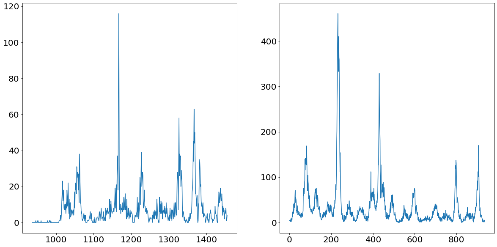
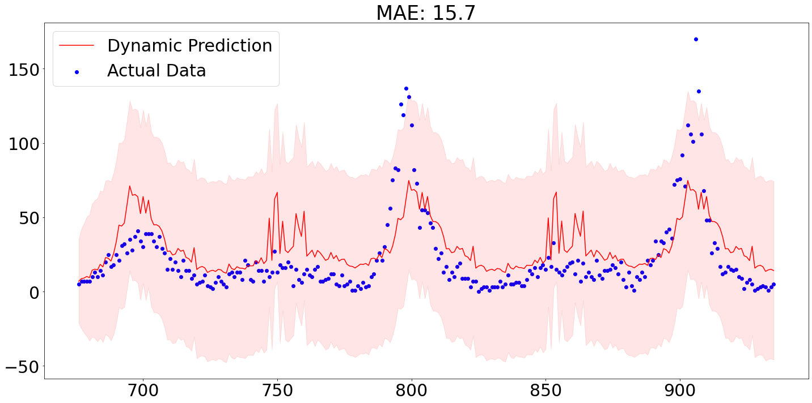
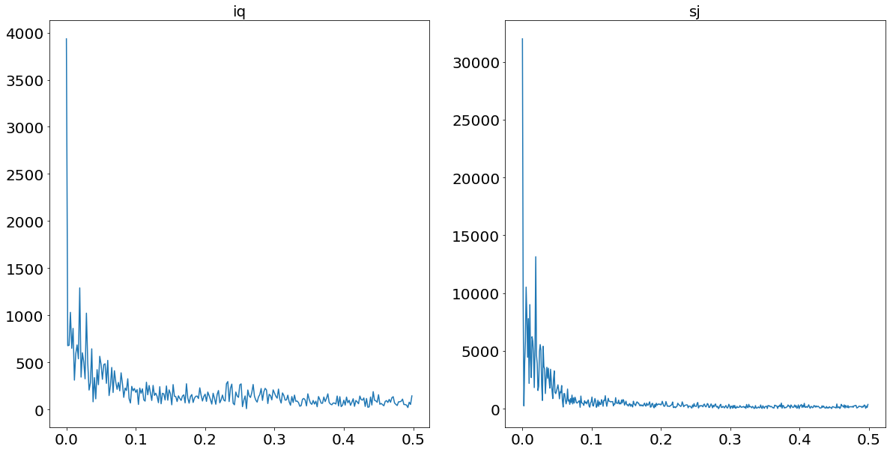
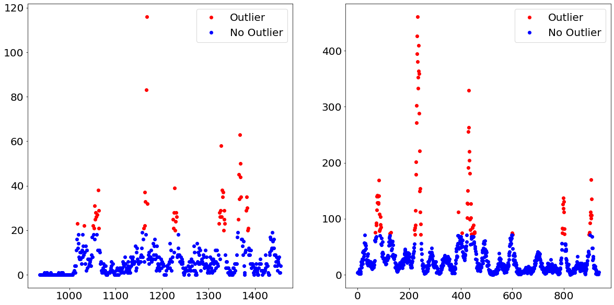
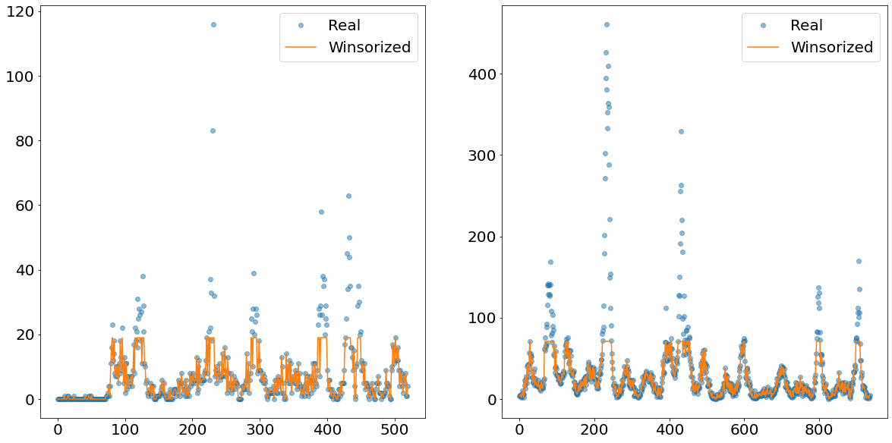
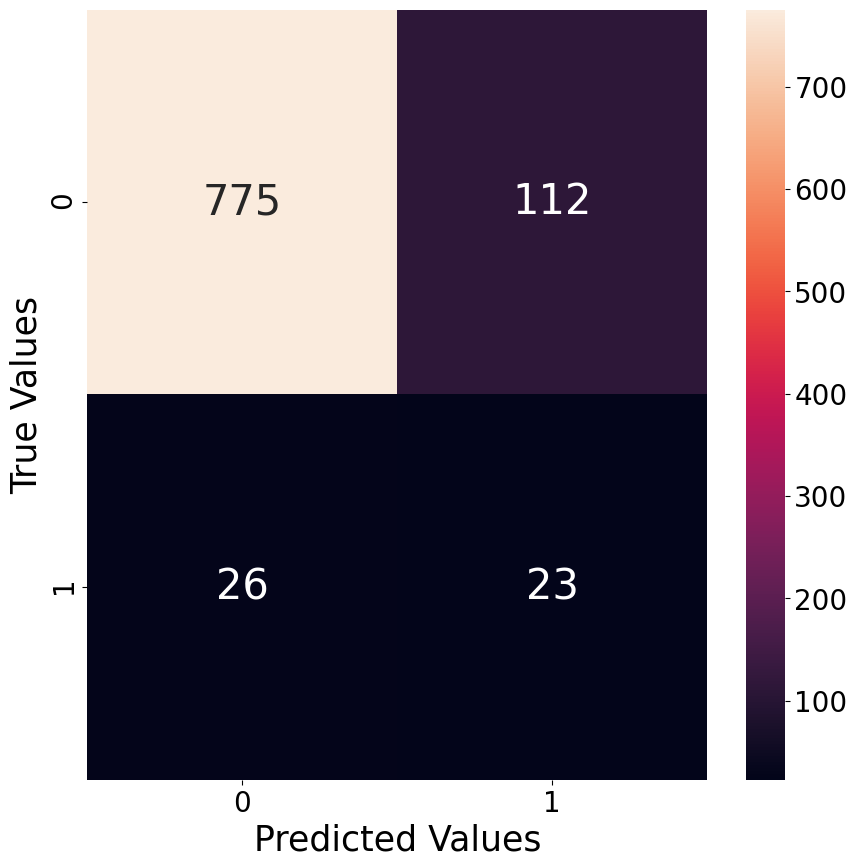
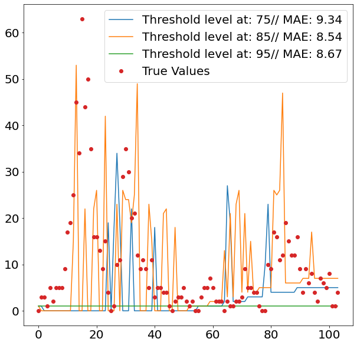
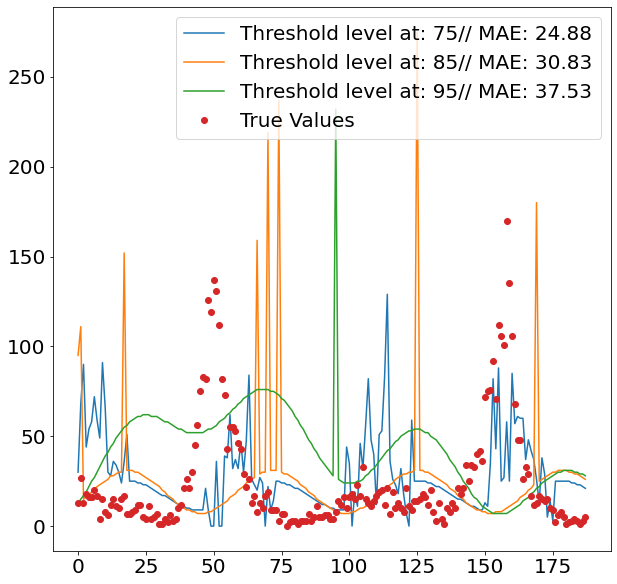

*Using a combination of regression, classification and smoother for our second take on the DengAI challenge.*

## Background Information

This post represents one out of two posts in which we are discussing our second attempt on the Data Science Challenge: DengAI from Drivendata.org, which can be found [here](https://www.drivendata.org/competitions/44/dengai-predicting-disease-spread/).

In this challenge we are asked to predict the number of cases of dengue fever in the two cities San Juan and Iquitos given time-series data of several feature variables with around ~900 and ~500 observations for each city respectively. On the website we also find some more information about the disease:

*'Dengue fever is a mosquito-borne disease that occurs in tropical and sub-tropical parts of the world. In mild cases, symptoms are similar to the flu: fever, rash, and muscle and joint pain. In severe cases, dengue fever can cause severe bleeding, low blood pressure, and even death.'*

Particularly challenging for this challenge is the the fact that we are asked to predict around 250 time-steps into the future. Predicting that many periods comes especially challenging when having not that many observations for training purposes.

The DengAI challenge is likely to be the most popular prediction challenge on DrivenData.org, having more than 10.000 participating teams as of April 2021.

## Structure of this post

We begin this post by taking a look at the target variable and discuss what makes the prediction of that time-series so difficult. Afterwards we discuss our key learnings from our last attempt on this challenge and what we aim to improve this time.

The second part of this post then discussing the prediction methodology and shows its implementation into code. In the end we show our results, and the score we got for our prediction.

### Target variable

One of the first steps before deciding on the strategy of the forecasting methodology is to take a thorough look at the target variable. As mentioned already earlier, we are facing a panel dataset in this challenge. *Panel data* means we have time-series data for multiple entities, namely for the two cities San Juan and Iquitos.
Below we find plots of the number of dengue fever cases for the two cities San Juan (left) and Iquitos (right).


```python
import os
os.getcwd()
```


    '/Users/paulmora/Documents/projects/dengai_ensemble/notebooks'


```python
import os
import pandas as pd
import matplotlib.pyplot as plt

os.chdir(r"../")
import src._config # Contains matplotlib settings to be applied to all graphs

target_data = pd.read_csv("data/dengue_labels_train.csv")
city_names = set(target_data.loc[:, "city"])
n_cities = len(city_names)
fig, axs = plt.subplots(figsize=(10*n_cities, 10), ncols=n_cities)
axs = axs.ravel()
for i, city in enumerate(city_names):
    city_data = target_data.query("city==@city").loc[:, "total_cases"]
    axs[i].plot(city_data) 
```


    

    


From the chart above we can nicely see that both time series follow a somewhat yearly seasonality. That would make sense as we would assume that the mosquito population is peaking every summer and nearly go extinct in the winter times. What is even more apparent are the massive spikes in the time series. Ar around observation number 1150 for Iquitos and around 200 for San Juan we see unprecedented level of dengue fever cases. These values are going to be difficult to deal with, as they are so prominent that they could badly affect our model performance.

## One model for both cities vs. One model for each city

When facing panel data, the question arises whether we build one model for each entity, or whether we use one model for both entities (a so-called pooled model). Training one model for both entities would potentially come with the benefit of having cross-learning opportunities. Meaning that the prediction for one entity would be enhanced when using the trainings data from another entity. This is only possible though if the data generating process is the same or at least not significantly different from one another.

If the distribution between entities is fundamentally different, then any prediction model will have a hard time trying to predict to significantly different time-series. For the purpose of testing whether the two distributions are fundamentally different we are using a Kolmogrov Smirnov test. From the strongly significant p-value we conclude that the data generating process is not the same and therefore decide to train two individual prediction models.


```python
from scipy import stats

san_juan = target_data.query('city=="sj"').loc[:, "total_cases"]
iquitos = target_data.query('city=="iq"').loc[:, "total_cases"]
stats.ks_2samp(san_juan, iquitos)
```


    Ks_2sampResult(statistic=0.5068376068376068, pvalue=4.7991921470916946e-76)


## Learnings from previous attempt

Given that we already tried ourselves on the DengAI challenge in the past, it is worthwhile to talk about what has been tried, what went wrong and what could be improved for the next attempt.

During our last attempt we build a [STL Forecasting model](https://www.statsmodels.org/stable/generated/statsmodels.tsa.forecasting.stl.STLForecast.html) with an underlying ARIMA model. The ARIMA was parameterized using the Box-Jenkins methodology, which is the go-to method when doing that.

The flaw of this model, or any ARIMA model for that matter, is that those models are not designed for long-term forecasts. That is because ARIMA models are mean-reverting and therefore useless when it comes to forecasts longer than a few periods. Especially with time-series which are as bumpy as the ones we are trying to predict, this forecasting method was wrongly placed.

Below we see that out-of-sample predictions from our model for the city San Juan. The out-of-sample prediction were produced by using the first 80% of the data for training purposes and applying the parameterized model then on the remaining 20%.

As we can see, the MAE of around 15.7 is actually not too bad, though we are failing to accurately predict the spikes.



One positive aspect of our last attempt was to for allow multiple seasonalities through the STL part of the model. STL or *seasonal-trend decomposition using LOESS* is normally used to decompose a time series into its three components: seasonality, trend and residual. Splitting a time-series into its components comes handy when trying to make the series stationary, which normally would involve removing the trend and potentially even it's seasonality.

The benefit of allowing for multiple seasonalities becomes particularly apparent when plotting a **power-spectrum** for both time-series. A power-spectrum gives us an idea what the driving frequencies of a series are. This concept is easier understood when imaging that we are not dealing with dengue cases over time, but rather with a sound wave of a song. All (interesting) songs consist out of multiple different sounds at the same time. The "sum" of all these sounds then result in the song as we hear it. Looking at the sound-wave of a song, it is difficult to tell which individual sounds are more prominent than others. In order to split the sound wave into its frequency components we are using a so-called [Fourier Transform](https://en.wikipedia.org/wiki/Fourier_transform). To then find out what the dominant frequencies are, we set a so-called *prominence level*. This prominence level serves us as a threshold, in order to find out what the driving frequencies are.

This concept is also applicable to time-series problems in order to find out which seasonality is dominant within the series. The following code plots the power-spectrum for the two time-series.

We set the threshold, which divides significant frequencies from insignificant ones, to two standard deviations above the median. We chose the median in contrast to the mean, given the heavy skewness the power-plots suffer from. These thresholds are always tricky to set, and will always end up being subjective.


```python
import numpy as np
from scipy import signal as sig

city_data = target_data.query("city==@city").loc[:, "total_cases"]

fig, axs = plt.subplots(figsize=(10*n_cities, 10), ncols=n_cities)
axs = axs.ravel()
for i, city in enumerate(city_names):
    signal = target_data.query("city==@city").loc[:, "total_cases"]

    fft = np.fft.fft(signal)
    magnitude = np.abs(fft)
    frequency = np.fft.fftfreq(len(signal))

    left_magnitude = magnitude[:int(len(magnitude)/2)]
    left_frequency = frequency[:int(len(frequency)/2)]

    prominence = np.median(left_magnitude) + 2 * np.std(left_magnitude)
    peaks = sig.find_peaks(left_magnitude[left_frequency >= 0], prominence=prominence)[0]
    peak_freq = left_frequency[peaks]
    list_frequencies = (1/peak_freq).tolist()

    axs[i].plot(left_frequency, left_magnitude)
    axs[i].set_title(city)
    print(f"The relevant frequencies for {city} is/are: {list_frequencies}")
```

    The relevant frequencies for iq is/are: [52.0]
    The relevant frequencies for sj is/are: [187.2, 93.6, 52.0, 33.42857142857142]


    

    


From the print statement above we see that we find yearly seasonality for Iquitos, and four different and prominent frequencies for San Juan. This finding supports our hypothesis of the benefit of a model which allows for multiple seasonalities.

## Forecasting Methodology

The inspiration for our new modeling approach came during one of the brain-storming sessions at work. At the time we were working for a large insurance company and we were building a claims forecasting model.

The business model of an insurer relies on the foundations that most people do not have to make use of their insurance most of the time. That means that in most months the customers of an insurer simply pays into the insurance without filling any claims. That means that most entries of the claims data of an insurance are zero. A phenomena which Data Scientists would describe as *'sparse'* data.

That sparsity makes it significantly more difficult to predict the claims variable. Academia provides us with several suggestions on how to tackle this problem. One potential approach to model that behavior is suggested in the paper of Andrea Andrea Dal Pozzolo 2010 [1]. Herein the author splits the forecasting problem into two different parts. Firstly, a classification problems in which we classify whether the claim is having a payout or not. In the second step we apply a regression model to the observations which are non-zero.

The benefit of this approach is that the regression model could focus more on observations which are non-zero and therefore is able to better cope with the spikes within the target.

Applying this approach on our data is not as straightforward. That is mainly because of two reasons: 

1. Classification Problem: In contrast to the insurance claims data we do not find many (if any at all) observations which have a target value of zero
2. Time-series Problem: In contrast to the outlined paper we face time-series data instead of cross-sectional data
3. Imbalancement Problem: Given the nature of *outliers*, how are dealing with the fact that our classifier sees mostly *non-outliers* while training

The following subsections elaborate on how we are dealing with these problems.

### 1. Classification Problem
To address the first problem, namely that our data is not as easily divided into observations which are either zero or non-zero, the following idea was drafted. Instead of trying to figure out which observations are non-zero, we try in a first instance to figure out which observation belongs to an unusual high level within the time-series, a.k.a. dengue fever outbursts.

We do that by separating the target variable into *outliers* and *non-outliers*. For example, we define every observation above the e.g. 90th percentile as *outliers* and all of the other observations as *non-outliers*. By doing that we turned the target variable from an integer to a binary, which allows us to apply a classification model. Afterwards, we apply a regression model on only those observations which are predicted to belong to the *outliers* class.

Below we show how exactly that separation would look like when using the 90th percentile as the threshold between *outliers* and *non-outliers*.


```python
import numpy as np

THRESHOLD = 90
fig, axs = plt.subplots(figsize=(10*n_cities, 10), ncols=n_cities)
axs = axs.ravel()
for i, city in enumerate(city_names):
    city_data = target_data.query("city==@city").loc[:, "total_cases"]
    level_threshold = np.percentile(city_data, THRESHOLD)
    bool_threshold = city_data > level_threshold
    axs[i].plot(city_data[bool_threshold], color="red", label="Outlier", linestyle="None", marker="o")
    axs[i].plot(city_data[~bool_threshold], color="blue", label="No Outlier", linestyle="None", marker="o")
    axs[i].legend()
```


    

    


### 2. Time-Series Problem

The other problem we are facing is that we are dealing with a time-series problem in contrast to a cross-sectional problem we had in the insurance context.

When predicting which observation belongs to the *outliers* group, we are treating the problem as if it were a cross-sectional problem. Hence, ignoring the time component altogether.

Afterwards, we are predicting the *outliers* group through a regression model. For the *non-outliers* group, which will represent the majority of the observations, we will use a time-series prediction model. In order to be able to do that, we have to have a time-series with no missing observations. Though, in order for the *outliers* not to affect the *non-outliers* prediction method, we have to replace the extreme values. This is done through a method called [**winsorizing**](https://en.wikipedia.org/wiki/Winsorizing).

What this method does is that it cuts off everything above the Xth percentile and replaces the values with the value of exactly this Xth percentile. In the image below we show an example how the time-series of the *non-outliers* would look like if we winsorize at the 90th percentile level.

The orange line shows nicely how everything above a certain absolute level is cut-off and replaced. This newly created line is then separately predicted using an exponential smoother called TBATS. This smoother has the benefit of being able to deal with multiple seasonalities.


```python
from scipy.stats.mstats import winsorize

def winsorize_data(data, upper_threshold):
    """This function cuts the data at the upper threshold"""
    one_minus_upper_bound = 1-(upper_threshold/100)
    cutted_data = winsorize(data, limits=[0, one_minus_upper_bound], inclusive=(True, False)).data
    return cutted_data

THRESHOLD = 90
fig, axs = plt.subplots(figsize=(10*n_cities, 10), ncols=n_cities)
axs = axs.ravel()
for i, city in enumerate(city_names):
    city_data = target_data.query("city==@city").loc[:, "total_cases"]
    winsorized_data = winsorize_data(city_data, THRESHOLD)
    axs[i].plot(city_data.values, label="Real", linestyle="None", marker="o", alpha=0.5)
    axs[i].plot(winsorized_data, label="Winsorized")
    axs[i].legend()
```


    

    


### 3. Imbalancement Problem: Oversampling

After dealing with the time-series problems, it is now time to address a problem occurring within the classification of *outliers* and *non-outliers*, namely the heavy imbalanced data. Imbalanced data describes the situation within classification problems, in which we have significantly more observations from one class compared to another class. This would impact our model-performance, as the model does not have a sufficient amount of *outliers* observations to properly learn which statistical properties constitute the concept of *outliers*.

In order to combat that problem, there are multiple approaches of how to tackle that. We could for instance undersample the majority class (i.e. *non-outliers*), or alternatively, oversample the minority class. We decided to go with the later approach, but use a synthetic oversampler instead of using random sampling.

Synthetic minority oversampling describes a technique in which new observations of the minority classes are created by finding observations which are “like” the existing ones, but are not completely identical. One of the most popular methods is called **SMOTE**, which stands for Synthetic Minority Oversampling Technique.

The exact workings and visualization of how SMOTE works will be outlined in a separate post, but the basic idea is quickly understood: One imagines that we only have two features and we plot all observations on a scatter plot, having each feature on one axes. The next step is then to draw connecting lines between every observation. The newly created values would then be created on these connection lines. This strategy is only one of many potential ways of how to use the SMOTE oversampling technique.

One quite important parameter within all oversample techniques is called the **sampling_strategy**. This parameter describes how big the minority class should grow in compared to the majority class. If we for example have a minority class which represents 10% of the amount of the majority class and we specify a sampling_strategy of 0.5, then we would create 40 percentage points more of the minority class.

In the original paper of SMOTE it is suggested that a combination of oversampling of the minority class and undersampling the majority class leads to favorable results. For now we only use 100% oversampling of the minority class, though gridsearching over a range of oversampling values would be favored.

## Code Implementation

After covering the overall concept, it is now time to see how the high level code implementation looks like.

In the following we will import quite a few self written pipeline packages as well as functions. Those are not going to elaborated on, given that it would be quite a bit of code to show. Though, in order to give a better overview what is happening in the back, we published another post about the workings of the feature engineering pipeline.


```python
from tqdm import tqdm
import numpy as np
from imblearn.over_sampling import SMOTE
from imblearn.pipeline import make_pipeline as imblearn_make_pipeline
from sklearn.linear_model import LogisticRegression, LinearRegression
from sklearn.ensemble import (RandomForestClassifier, GradientBoostingClassifier,
                              RandomForestRegressor, GradientBoostingRegressor)
from sklearn import svm
from sklearn.metrics import mean_absolute_error
from sklearn.model_selection import GridSearchCV, train_test_split
from src._classes import (Encoding, ColumnCorrection, Transformer, Stationarity, Imputer, FeatureCreation,
                          FeatureSelection, TBATSWrapper, ModelSwitcher)
from src._functions import (city_query, winsorize_data, combining_models, plotting_predictions, save_prediction_results)
import src._config
```

Potentially worth highlighting is that we are not using the *make_pipeline* function from scikit-learn, but rather the version from the *imblearn* package. The reason for that is that when using any over-/downsampling algorithm from imblearn, using *make_pipeline* from scikit-learn does not work anymore. In order to fix that, the guys from imblearn came up with their own version of pipeline function, which works equally in all respects but allows for over-/downsampling methods.

Next up would be to specify the parameters which feed into the pipeline. Here we will define for example how many cross validations are conducted, what the maximum lag within the feature creation is going to be and so on.

Note that we are choosing *precision* as the classification scoring method since we are more worried about False Positives than False Negatives. This is because of theoretical as well as empirical reasons. When experimenting with different classification models we note that the model labels significantly more observations as *outliers* even though they are not, than the other way around. Given this behavior of being more prone towards to False Positive mistakes it would make sense to fight against that, using the *precision* scoring function. Secondly, labeling an observation as an *outlier* even though it is none would trigger a spike, which is much riskier compared to having a moderate value when it should be a spike.

When it comes to the error metric for the regression problem we decided to go for the very same metric as the entire Data Challenge DrivenData.org applies, namely *Mean Absolute Error*.


```python
# Pipeline settings
cv = 2
N_NEIGHBOURS = 10
DEGREE = 2
MAX_LAG = 4
SIGNIFICANCE_LEVEL = 5 / 100
RS = 42
e_list = [0.01, 0.05, 0.1, 0.25, 0.5]
clf_scoring = "precision"
reg_scoring = "neg_mean_absolute_error"
```

### Classification Pipeline

The next step is now to set up the first step of the forecasting methodology, which is the pipeline for predicting whether the observation belongs to the *outlier* class.

Therefore, when setting up the pipeline we have to be aware of two things. Firstly, we have to specify that we are facing a classification problem within the **FeatureSelection**. Given that our feature selection is model based, that argument will trigger classification models, rather than regression models. Furthermore, we are specifying an oversampling algorithm SMOTE into the pipeline, which was already elaborated on above.

Given that we would like to try multiple forecasting models with the pipeline, we apply the trick of creating a **ModelSwitcher** class which can intake different models as hyper-parameters within a gridsearch operation. This concept is further elaborated on within the other post of this series.

The range of models we would like to try are stated below as well. Given that the feature-selection class needs a prediction model specified as well, in order to find the optimal value for *e* (the purpose of which explained in the pipeline post) we have to specify the model twice. Given run-time considerations we only allow for no hyperparameter-gridsearching.


```python
# Classification Pipeline
clf_pipeline = imblearn_make_pipeline(
    Encoding(),
    ColumnCorrection(),
    Stationarity(SIGNIFICANCE_LEVEL=SIGNIFICANCE_LEVEL),
    Transformer(),
    Imputer(n_neighbors=N_NEIGHBOURS),
    FeatureCreation(degree=DEGREE, max_lag=MAX_LAG),
    FeatureSelection(e_list=e_list, scoring=clf_scoring, clf=True),
    SMOTE(random_state=RS),
    ModelSwitcher()
)

clf_parameters = [
    {"modelswitcher__estimator": [svm.SVC(random_state=RS)],
     "featureselection__estimator": [svm.SVC(random_state=RS)]},

    {"modelswitcher__estimator": [LogisticRegression(random_state=RS)],
     "featureselection__estimator": [LogisticRegression(random_state=RS)]},

    {"modelswitcher__estimator": [RandomForestClassifier(random_state=RS)],
     "featureselection__estimator": [RandomForestClassifier(random_state=RS)]},

    {"modelswitcher__estimator": [GradientBoostingClassifier(random_state=RS)],
     "featureselection__estimator": [GradientBoostingClassifier(random_state=RS)]},
]

clf_gscv = GridSearchCV(estimator=clf_pipeline, param_grid=clf_parameters, scoring=clf_scoring, cv=cv)

```

### Regression Pipeline

The pipeline for the regression part of this forecasting is pretty similar to the pipeline used for classification purposes. The main differences being only that we do not need any oversampling method and that we are now initializing regression instead of classification models.


```python
# Regression Pipeline
reg_pipeline = imblearn_make_pipeline(
    Encoding(),
    ColumnCorrection(),
    Stationarity(SIGNIFICANCE_LEVEL=SIGNIFICANCE_LEVEL),
    Transformer(),
    Imputer(n_neighbors=N_NEIGHBOURS),
    FeatureCreation(degree=DEGREE, max_lag=MAX_LAG, lagged_features=False),
    FeatureSelection(e_list=e_list, scoring=reg_scoring, clf=False),
    ModelSwitcher()
)

reg_parameters = [
    {"modelswitcher__estimator": [LinearRegression()],
     "featureselection__estimator": [LinearRegression()]},

    {"modelswitcher__estimator": [RandomForestRegressor(random_state=RS)],
     "featureselection__estimator": [RandomForestRegressor(random_state=RS)]},

    {"modelswitcher__estimator": [GradientBoostingRegressor(random_state=RS)],
     "featureselection__estimator": [GradientBoostingRegressor(random_state=RS)]}
]

reg_gscv = GridSearchCV(estimator=reg_pipeline, param_grid=reg_parameters, scoring=reg_scoring, cv=cv)

```

Lastly, we implement the entire forecasting methodology in one function.

The functions starts by turning the target variable into a binary variable by separating the observations into *outliers* and *non-outliers* by using a certain percentile level. This is done by the function called *find_top_n_obs*.

Then it is time to fit the classification pipeline on the data and determine the best model. After the fitting procedure we then use the chosen and fitted model to make in-sample predictions, as well as apply the model on the test data. In order to have an idea about the performance of the model, we also show a confusion matrix below.

After splitting the observations into either the *outliers* or *non-outliers* class, we then apply the regression pipeline on the former group and the exponential smoother on the latter.

When predicting the *outliers* we have to make sure that our function can deal with the case in which no observation within the test data has been classified as as an *outlier*

The *non-outliers* are then inputted in the TBATS smoothing model, which uses the aforementioned winsorization technique. It is noteworthy that the TBATS model comes from **statsmodels** and therefore does not natively support any pipeline application. We therefore build a wrapper around the TBATS in order to still use the *fit* and *predict* commands we grown used to from scikit-learn.

As the last step we then combine the results from all models. This is done by taking the predicted time-series from TBATS and replace those values which are predicted to be *outliers* with the values we got from the regression model.


```python
def combination_model(X_train, X_test, y_train, threshold):

    # Classification
    binary_target = y_train >= np.percentile(y_train, threshold)
    clf_gscv.fit(X_train, binary_target)
    clf_pred_train = clf_gscv.best_estimator_.predict(X_train)
    clf_pred_test = clf_gscv.best_estimator_.predict(X_test)

    # Regression
    subset_x_train, subset_y_train = X_train.loc[clf_pred_train, :], y_train[clf_pred_train]
    subset_x_test = X_test.loc[clf_pred_test, :]
    reg_gscv.fit(subset_x_train, subset_y_train)
    if sum(clf_pred_test) != 0:
        reg_y_pred_test = reg_gscv.best_estimator_.predict(subset_x_test).round().astype(int)
    else:
        reg_y_pred_test = []

    # Smoother
    winsorized_y_train = winsorize_data(data=y_train, upper_threshold=threshold)
    smt = TBATSWrapper().fit(X=X_train, y=winsorized_y_train)
    smt_pred_test = smt.predict(X=X_test)

    # Combination models
    total_pred_test = combining_models(clf=clf_pred_test, reg=reg_y_pred_test, smt=smt_pred_test, index_df=X_test)
    return total_pred_test
```

In order to have an idea of how good a classification model performs, we plot a confusion matrix of the best performing hyper-parameter version. Below we give an example of the best model for the classification of *outliers* for the city of San Juan when classifying the 95th percentile as the threshold between the *outliers* and *non-outliers* class.

As already mentioned earlier, the classification model tend to have more False Positives than False Negatives, which is nicely visible through the confusion matrix below. The relatively poor performance is also likely the reason why this approach does not work as well as we hoped it would. It seems that the high spikes in values are not predictable with the features at hand.



## Predictions

After setting all the pipelines up, we can now loop over the two cities San Juan and Iquitos, as well as over the different percentiles from which we divide observations into *outliers* and *non-outliers*. We decide to go for three levels, namely 75, 85 and 95. Since we are only interested in defining the out of the ordinary spikes, it makes sense to set the separation level relatively high.

In order to get an idea how the model performs out-of-sample, we divide the dataset into train and test, using 80% of the data as the trainings data and the remaining 20% to assess our predictive power, using **Mean Absolute Error**.


```python
test_pred_results = {}
threshold_list = [75, 85, 95]
for city in tqdm(["iq", "sj"]):
    mae_list, y_pred_list = [], []
    for threshold in tqdm(threshold_list):

        # Load data
        X_train_total, X_test_total, y_train_total = city_query(city)
        X_train, X_test, y_train, y_test = train_test_split(X_train_total, y_train_total, test_size=0.2, shuffle=False)

        # Predictions
        y_pred = combination_model(X_train, X_test, y_train, threshold)
        mae = mean_absolute_error(y_test, y_pred)

        mae_list.append(mae)
        y_pred_list.append(y_pred)

    plotting_predictions(y_pred_list, y_test, threshold_list, mae_list, city)
    threshold_level = threshold_list[np.argmin(mae_list)]
    test_pred_results[city] = combination_model(X_train_total, X_test_total, y_train_total, threshold_level)
save_prediction_results(test_pred_results)
```

      0%|          | 0/2 [00:00<?, ?it/s]
      0%|          | 0/3 [00:00<?, ?it/s]
     33%|███▎      | 1/3 [01:08<02:16, 68.17s/it]
     67%|██████▋   | 2/3 [02:02<00:59, 59.93s/it]
    100%|██████████| 3/3 [03:48<00:00, 76.19s/it]


    

    


     50%|█████     | 1/2 [04:43<04:43, 283.97s/it]
      0%|          | 0/3 [00:00<?, ?it/s]
     33%|███▎      | 1/3 [01:37<03:15, 97.84s/it]
     67%|██████▋   | 2/3 [02:45<01:20, 80.31s/it]
    100%|██████████| 3/3 [05:39<00:00, 113.04s/it]


    

    


    100%|██████████| 2/2 [12:05<00:00, 362.89s/it]


## Results

The images above show nicely what difference the respective threshold made. The highest threshold (95%) has the fewest spikes, which makes sense, as it is trained to only react to more prominent spikes. As we can see from the second images, this comes with a cost, as it fails to detect spikes when it should, and even finds spikes where in reality there isn't one.

Given that the 75% threshold sees more data when training the regression model, the regressed values tend also to be more moderate, which explains its relatively strong performance.

The two images though, also clearly show that the overall method does not seem suitable for the job, as it fails to accurately detect when spikes are occurring. This failure within the classification model then fatally hurts the overall prediction performance. Interestingly it also seems that the seasonality of all three models is off by some periods. This is visible by the fact that all model seem to have upticks a couple of periods later, then the actual data suggests.

The achieved performance by the model after submitting our result on DrivenData.org also reflects our moderate success on predicting the target variable. Nevertheless, the journey taught us multiple lessons, and it will not be the last time we will work on the DengAI challenge.


## Appendix

[1] Andrea Dal Pozzolo. (2010). Comparison of Data Mining Techniques for Insurance Claim Prediction. https://dalpozz.github.io/static/pdf/Claim_prediction.pdf
